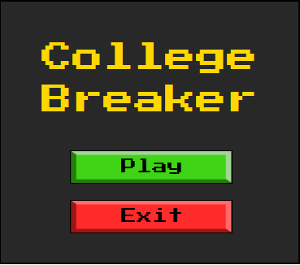

# Објаснување на проблемот
 
Нашиот проект претставува варијација на играта Brick Breaker, со име College Breaker.
Играта има неколку главни компоненти:
* Цигли
* Топче
* Платформа
* Тајмер за времето на нивото
* Моментален просек
* Моментален семестар (ниво)

Идеата на играта е секој семестар (вкупно 8) да биде претставен со по едно ниво. Секоја цигла во играта претставува по една оценка. Целта на играта е да се поминат сите нивоа (семестри) со што е можно поголем просек. Секој brick претставува по една оценка (од 6 до 10), а дополнително има и "fail" bricks кои го намалуваат просекот.
При преминување на наредно ниво (семестар) се намалува времето кое играчот го има за да го помине нивото. Исто така се зголемува брзината на топчето и платформата која е контролирана од играчот.

# Решение на проблемот

### Форми

##### MainForm

Оваа форма се прикажува прва при вклучувањето на играта. Таа има функција на почетно мени каде што е прикажан насловот на играта (College Breaker), копче `Play` за започнување на играта, како и копче `Exit` со што може да се исклучи апликацијата. Во класата од оваа форма се чуваат објекти од трите форми наведени подолу, како и објект од класата SoundPlayer кој што се користи за контролирање со аудио фајлот кој е присутен низ целата игра. Формата има неколку функции кои што се справуваат со притискање на копчињата и функција која се справува движење на долунаведените форми со помош на кликање на ScoreForm и движење на маусот при што сите форми се движат заедно во една целина.

##### ScoreForm

Оваа форма се отвара од MainForm и во неа се прикажани просекот на оценките и моменталното ниво (семестар). Пресметките за просекот и нивото се направени од надворешна класа која што е наведена подолу.

##### ToolsForm

Во ToolsForm е прикажан тајмерот за моменталното ниво и 3 копчина со кои може да се паузира играта, да се повтори истото ниво од почеток и да се изгасни играта целосно. Оваа форма не чува свој тајмер туку само лабела која што го прикажува преостанатото време за нивото што се пресметува во посебна, надворешна класа Levels. Формата има неколку функции за справување со клик на некое од трите копчиња како и функција што ја проверува моменталната состојба на играта односно дали играта е паузирана или не, дали е победено нивото или целата игра. Состојбите на играта се чуваат во посебна класа Game која што детално е опишана во наредната точка.

##### GameForm

Оваа форма е главната форма во која што се одвива целата игра. Во неа се исцртуваат топче, платформа од која што се одбива топчето и 20 цигли (bricks). Кога ќе истечи тајмерот од претходно наведената форма, нивото завршува и се преминува на наредно ниво. Ако топчето падни под платформата или ако просекот на оценки кој е прикажан во ScoreForm падне пониско од 6, играчот губи и мора повторно да го игра истото ниво. Формата чува објект од класата Game, која што е една од најважните класи во апликацијата, чува два тајмери за движење на играчот (платформата) и топчето и има повеќе функции за справување со притискање на копчината за движење на платформата, поставување на панел кој прикажува дали играта е паузирана, дали играта е изгубена или победена и др.

### Класи

##### WindowHandler

Оваа е едноставна статичка класа која се користи за справување со основни настани како гасење на апликацијата, придвижување на формите со click-and-drag механика на панелот од ScoreForm, како и некои дополнителни минимални функционалности.

##### ControlHandler

Поради тоа што играта користи специфичен нестандарден фонт, во оваа класа се доделува фонтот на елементите кои ја користат класата. Како и претходната, и оваа класа е статичка поради тоа што нема потреба да се чуваат посебни објекти за справување со контролите во сите форми. Исто така, оваа класа содржи функции кои што се користат за вертикално центрирање во формата (**VerticalAlign**), за хоризонтално центрирање (**ControlAlign**), за поставување на фонт (**SetFont**) и функција за земање на фонтот (**GetFont**) од некоја контрола што се предава во самата функција. Потребата за сите овие функции е тоа што фонтот кој се користи се наоѓа во **Resources** од самиот проект со што се исфрла потребата фонтот да се инсталира мануелно на компјутерот.

##### ImageHandler

ImageHandler e едноставна класа која се справува со сликите кои се користат на разновидните копчиња во апликацијата. Оваа класа е статичка и содржи 3 функции:
* **SetImageOpacity** - има задача да ја мести транспарентноста на сликата.
* **MouseEnter** - при поставување на курсорот над некое копче, се повикува SetImageOpacity и се зголемува транспарентноста на сликата
* **MouseLeave** - спротивно од претходната, со движење на курсорот надвор од копчето, се враќа оригинална транспарентност на копчето.

##### Ball

Во оваа класа се чуваат податоци за брзина на топчето, насока на движење, сликата што се исцртува. Сите овие се потребни за топчето кое што е прикажано во GameForm. Класата содржи функции кои манипулираат со податоците со тоа што го исцртуваат топчето, го движат, ја ресетират неговата позиција и ја зголемување на брзината на движење на топчето.

##### Platform

Оваа класа го претставува самиот играч односно платформата од која што треба да се одбие топчето. Во неа се чуваат податоци за брзината на платформата, функции за нејзиното исцртување, движење и ресетирање.

##### Movables

Целта на оваа класа е да претстaвува некаков container за претходните две класи (**Ball** и **Platform**). Класата содржи функција која што ги исцртува топчето и платформата, ја пресметува локацијата на топчето во однос на платформата со што е овозможено платформата да биде поделена на 5 делови од кои централниот дел го одбива топчето вертикално на горе, а останатите делови, движејќи се кон краевите на платформата, го одбиваат топчето под се поголем агол.

##### Levels

Класата Levels содржи податоци за моменталното ниво. Такви податоци се:
* Преостанати цигли што треба да се скршат
* Тајмерот за тоа ниво
* Времето за завршување на нивото
* Моменталниот број на ниво и други.

Оваа класа содржи важни функции како:
* Генерирање на цигли според одредена веројатност во зависност од нивото
* Контролирање на тајмерот за нивото
* Пресметување на моменталниот просек на оценки
* Исцртување на циглите
* Проверка за тоа дали топчето имало некаква интеракција со некоја од циглите
* Преминување на наредно ниво или повторување на истото, итн.

##### GameInfo

GameInfo е минимална класа, во која што се содржи полиња за моменталната состојба на играта. Оваа класа се користи при предавање на податоците кон останатите класи со користење на **Observer Design Pattern**.

##### Game

Оваа е една од најважните класи која се справува со голем број на функционалности. Во неа се чуваат моменталниот статус на играта кој може да биде `Running, LevelBeat, GameBeat, GameLost, Paused`. Исто така во неа се чува моменталното ниво (објект од класата **Levels**), дали играта е паузирана или не и др. Оваа класа ја наведoвме како најважна класа поради тоа што таа комуницира со сите форми во апликацијата, односно користи **Observer/Subscriber** функционалност. Целосната функционалност на оваа класа е наведена подолу во наредната точка.

## Singleton and Observer Design Patterns

Со цел кодот да биде поедноставен и целата програма да има подобра стуктура, ги применивме **Singleton** и **Observer** шаблоните за развој.

### Singleton Design Pattern
Класата `Game` го користи шаблонот **Singleton**, бидејќи сите форми треба да презентираат единствена инстанца од класата `Game`. Овој шаблон го поедностави имплементирањето на **Observer** шаблонот. Сите форми во својот конструктор бараат референца од `Game`, а потоа со го повикуваат методот **Subscribe** кој е дел од **Observer** шаблонот.


### Observer Design Pattern
Сите форми кои треба да ја презентираат состојбата на моделот `Game` класата го имплементираат Observer шаблонот со цел да добиваат update при соодветни промени во моделот.
C# интерфејсите за **Observer** шаблонот (**IObservable** и **IObserver**) дефинират неколку методи, меѓутоа при комуникацијата во нашата програма ги користевме **Subscribe** и **OnNext** методите.

За потребите на Observer шаблонот ја развивме и класата `GameInfo` која користи за пренесување на информациите со помош на шаблонот.
Така генеричките **IObservable** и **IObserver** сега работат со `GameInfo` -  **IObservable<GameInfo>** и **IObserver<GameInfo>**.

**Subscribe** методот е дефиниран од **IObservable** шаблонот.
```csharp
public IDisposable Subscribe(IObserver<GameInfo> observer)
        {
            if (!observers.Contains(observer))
            {
                observers.Add(observer);
                observer.OnNext(new GameInfo(levels.PointsFromLevels, GetState(), levels.LevelTime));
            }
            return new Unsubscriber<GameInfo>(observers, observer);
        }
```
Овој метод им овозможува на објекти од други класи кои го имплементираат IObserver<GameInfo> интерфејсот да се регистрираат и да добиваат информации при промена на состојбата во оваа класа.
Методот враќа објект од класата **Unsubscriber** која го имплементира **IDisposable** интерфејсот. Со ова се овозможува објектот кој се претплатува да има начин да се отстрани себеси од листата на observers.

**OnNext** методот е дефиниран од **IObserver** шаблонот.
```csharp
public void OnNext(GameInfo info)
{
	if(info.State == Game.State.Paused)
	{
		PauseGame(true);
	}

	if (info.State == Game.State.GameBeat)
	{
		TimerFPS.Stop();
		SetEndScreen("Congratulations!\nYou've graduated!", 20);
		PanelPaused.Visible = true;
	}

	if (info.State == Game.State.LevelLost)
	{
		TimerFPS.Stop();
		SetEndScreen("Failed!", 24);
		PanelPaused.Visible = true;
	}

	if (info.State == Game.State.LevelBeat)
	{
		TimerFPS.Stop();
		SetEndScreen("Semester\nPassed!", 24);
		PanelPaused.Visible = true;
	}

	if (info.State == Game.State.Running)
	{
		Focus();
		PauseGame(false);
	}
}
```
Кодот горе претставува имплементација на **OnNext** методот во класата `GameForm`. Оваа класа е кодот за формата во која се одвива исцрувањето на сите елементи на играта кои се наоѓаат во `Game` класата. Методот **OnNext** се повикува од моделот од `Game` класата кога има промена во состојбата, за потоа гледајќи ги податоците испратени во `GameInfo` објектот, `GameForm` да ги превземе соодветните акции во **OnNext** методот.

# Опис на класата Game 

Решивме детално да ја опишиме класата **Game** затоа што, како што споменавме претходно, таа е една многу важна класа со огромна функционалност. Класата ги имплементира интерфејсите `IObservable<GameInfo>, IObserver<List<List<int>>>` кои што се користат за комуникација помеѓу сите форми. Исто така, оваа класа користи **Singleton Design Pattern** што овозможува целата апликација да работи само со еден објект од оваа класа. Податоците кои се чуваат во оваа класа се:

```csharp
// Instanca od klasata
private static readonly Game INSTANCE = new Game();

// Lista od Observers koi ja nabljuduvaat ovaa klasa za nekakvi promeni
private readonly List<IObserver<GameInfo>> observers;

// Momentalniot status na igrata
public enum State { Running, LevelBeat, LevelLost, GameBeat, GameLost, Paused }

// Objekt od klasata movables
public Movables movables;

// Objekt od klasata Levels
public Levels levels;

// Boolean promenliva koja pokazhuva dali nivoto e uspeshno zavrsheno ili ne
private bool levelLost;

// Boolean promenliva koja pokazhuva dali igrata e pauzirana ili ne
private bool paused;
```

Со помош на следната функција е овозможено само една инстанца од играта да има, односно Singleton Design Pattern

```csharp
public static Game GetInstance()
{
    return INSTANCE;
}
```

Функцијата **Notify** се користи за да ги известиме сите набљудувачи дека се случила некоја промена во играта

```csharp
private void Notify()
{
    GameInfo gameInfo = new GameInfo(levels.PointsFromLevels, GetState(), levels.LevelTime);
    foreach (IObserver<GameInfo> o in observers)
        o.OnNext(gameInfo);
}
```

Целта на функцијата **Pause** е да го стартува или да го стопира тајмерот за моменталниот левел кога играчот ќе го притисне копчето `Pause` што се наоѓа во ToolsForm.

```csharp
public void Pause(bool pause)
{
    if (pause)
        levels.LevelTimer.Stop();

    else if (!levels.LevelTimer.Enabled)
        levels.LevelTimer.Start();

    paused = pause;

    Notify();
}
```

Функцијата **GetState** е важна функција што ја враќа моменталната состојба на играта. Кога просекот на оценки е помал од 6 или ако променливата levelLost има вредност true, нивото е изгубено, па затоа функцијата враќа LevelLost. Кога играчот ја паузира играта, состојбата што се враќа од оваа функција е Paused. Ако играчот ги скрши сите цигли или ако помини времето од тајмерот, нивото се смета за победено и затоа функцијата враќа LevelBeat. Ако играчот ги победи сите 8 нивоа т.е. ги „положи“ сите 8 семестри, ја победува играта, па затоа се враќа состојбата GameBeat. И на крај, ако ниеден од претходните услови не е исполнет, тогаш знаеме дека сме во состојба на играње па затоа е враќа состојбата Running.

```csharp
public State GetState()
{
	if (paused)
		return State.Paused;

	if ((levels.GetMeanGrade() < 6 && levels.PointsFromLevels.Count != 0 
		&& levels.PointsFromLevels[0].Count != 0) || levelLost)
	{
		levels.LevelTimer.Stop();
		return State.LevelLost;
	}

	if (levels.CurrentLevelNumber == 8 && (levels.BrickCount == 0 || levels.LevelTime < 0))
		return State.GameBeat;

	if (levels.BrickCount == 0 || levels.LevelTime < 0)
		return State.LevelBeat;

	return State.Running;
}
```

Со помош на функцијата **Draw**, се повикуваат Draw методите од објектите movables и levels, со што се исцртуваат на екранот.

Функцијата **Advance** е функција што ја движи топката, проверува дали таа се допрела со некоја цигла при што треба да ја скрши таа цигла. Исто така, проверува дали нивото е изгубено и ако е, ги известува сите набљудувачи.

Функциите **NextLevel** и **RetryLevel** се користат за преминување на наредно ниво или повторно играње на истото ниво, соодветно. Двете функции ги ресетираат позициите на платформата и топчињата (со повикување на функцијата `movables.Reset()`), ги генерира циглите од нивото (со повикување на соодветната функцијата од класата Levels, `levels.NextLevel()` или `levels.RetryLevel()`). Во функцијата `NextLevel()` се зголемува брзината на топчето и платформата со што играта станува се потешка и потешка. Зголемувањето на брзината се извршува на секои 2 завршени нивоа со повикување на функцијата `movables.IncreaseSpeed()`. На крајот на двете функции има повик кон функцијата `Notify()` која како што беше претходно наведено, ги известува набљудувачите и му кажува дека нивото е победено или повторно треба да се игра.

Функцијата **Subscribe** овозможува објектите кои го имплементираат `IObservable<GameInfo>` интерфејсот, да бидат додадени на листата од набљудувачи observers.

**OnNext** методот е имплементиран како барање на `IObserver<List<List<int>>>` интерфејсот и се повикува од објектот кој го набљудуваме, во случајот `levels`. Во повикот ги добиваме сите нови информации од објектот levels, по што се превземаат акции врз основа на истите. 

## Упатство за играта

Со стартување на играта се појавува екранот за почеток. На него го имаме името на играта, копче за старт и копче за излез од играта.



Откако ќе избереме старт се отвараат трите главни форми на играта.
* Формата за приказ на моменталниот просек и семестар.
* Формата за приказ на преостанатото време за нивото и копчиња за контрола на играта - Pause, Retry, Exit.
* Формата во која се одвива играта. Тука се прикажани циглите, топчето и платформата која ја контролира играчот.


Ако за време на играњето го притиснеме копчето Pause играта се запира со тоа што се прикажува екранот за пауза и се запира тајмерот за преостанато време за нивото. Кога играта е паузирана копчето Pause се менува во Play кое служи за продолжување на играта.


Доколку за време на играњето просекот падне под 6, тогаш семестарот (нивото) се смета за изгубен и треба да се повтори. Притоа се прикажува екранот за изгубено ниво. Покрај ова копчето Pause не е повеќе достапно, а сега може да избереме само Retry или Exit.


Нивото може да се помине во два случаи: ако истече времето и просекот е над 6 или ако успееме да ги погодиме сите цигли со оценки. Притоа се прикажува екранот за успешно поминат семестар, а копчето Pause сега е заменето со копчето Next кое не' води кон наредното ниво.


Кога на крајот ќе го поминеме и последното, осмото ниво, играта звршува. Се појавуа екранот на кој е испишано дека играта е победена.